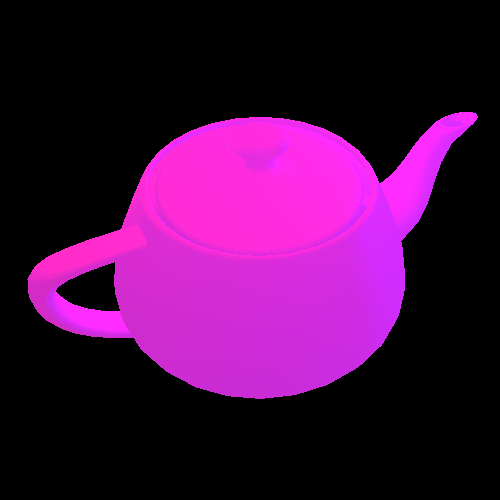

# Teapot OpenGL Visualization

This project is created to visualize a 3D teapot using OpenGL.



## Dependencies

To use the project you should install the following packages :

* `CMake`
* `OpenGL`
* `GLUT`

## Usage

In this section you can read about how to build and use this project.

### Building process

#### Linux

To build the project execute the following commands :

```bash
mkdir -p build && cd build
cmake ..
make
```

#### Windows

To build the project on Windows, just add CMake module to your MSVS and build the app.

### Running the app

#### Linux

To run the app just execute the following command :

``` bash
./teapot
```

#### Windows

You can launch the app from your MSVS.

### Controls
* `Left Click` will allow you to rotate the object
* `Right Click` allows you to zoom to the object